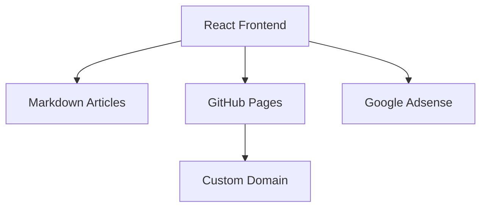
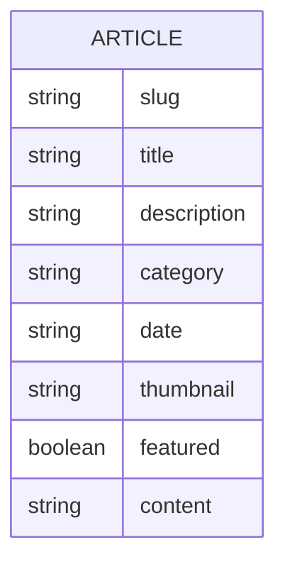

## 1. Architecture Design
Static site with React frontend, articles stored as Markdown files. GitHub Pages for hosting.



## 2. Technology Description
- Frontend: React@18 + TypeScript + tailwindcss@3 + vite
- Initialization Tool: vite-init
- Backend: None (static site)
- Database: None (articles as Markdown files)
- Markdown Processing: react-markdown
- Hosting: GitHub Pages

## 3. Route Definitions
| Route | Purpose |
|-------|---------|
| / | Home page |
| /article/:slug | Article detail page |
| /category/:category | Category articles page |
| /about | About page |

## 4. API Definitions (if backend exists)
Not applicable - static site with client-side routing.

## 5. Server Architecture Diagram (if backend exists)
Not applicable.

## 6. Data Model
### 6.1 Data Model Definition
Articles stored as Markdown files with YAML frontmatter.



### 6.2 Data Structure
Articles stored in `src/content/articles/` directory as `.md` files with frontmatter:
```yaml
---
slug: "article-slug"
title: "Article Title"
description: "Meta description"
category: "zero-waste"
date: "2024-01-01"
thumbnail: "https://..."
featured: true
---
Article content in Markdown...
```
