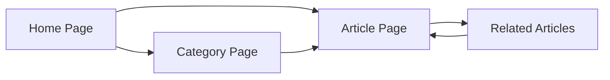

## 1. Product Overview
Simple Sustainable Living - A content website focused on practical, easy-to-follow tips for eco-friendly living in the US. Targets environmentally conscious individuals looking for actionable advice on reducing waste, saving money, and living sustainably.
- Core purpose: Drive organic traffic from US search engines, monetize with Google Adsense
- Market value: High search volume for sustainable living content, growing interest in eco-friendly lifestyles

## 2. Core Features

### 2.1 User Roles (if applicable)
| Role | Registration Method | Core Permissions |
|------|---------------------|------------------|
| Visitor | None | Browse all articles, search content |
| Admin | Manual (via repo) | Add/modify articles via Markdown files |

### 2.2 Feature Module
1. **Home page**: Hero section, featured articles, category navigation, latest articles
2. **Article page**: Full article content, related articles, social sharing
3. **Category page**: Articles filtered by category
4. **About page**: Site mission and introduction

### 2.3 Page Details
| Page Name | Module Name | Feature description |
|-----------|-------------|---------------------|
| Home page | Hero section | Eye-catching hero with site mission and CTA |
| Home page | Featured articles | 3 highlighted articles with thumbnails |
| Home page | Category navigation | Grid of categories (Zero Waste, Energy Saving, etc.) |
| Home page | Latest articles | Chronological list of recent posts |
| Article page | Article content | Markdown-rendered content with images |
| Article page | Related articles | 3 related posts based on category |
| Category page | Article grid | All articles in selected category |
| About page | Site info | Mission statement and content focus |

## 3. Core Process
Visitor arrives on home page → browses featured/latest articles → clicks article → reads full content → explores related articles/categories

## 4. User Interface Design
### 4.1 Design Style
- Primary colors: Forest green (#22c55e) and earthy beige (#fef3c7)
- Secondary colors: Soft blue (#60a5fa) for accents
- Button style: Rounded corners, subtle hover elevation
- Font: Playfair Display (headings), Source Sans Pro (body)
- Layout style: Clean card-based, generous whitespace
- Icon style: Minimal, nature-inspired line icons

### 4.2 Page Design Overview
| Page Name | Module Name | UI Elements |
|-----------|-------------|-------------|
| Home page | Hero section | Full-width gradient background, large heading, descriptive text |
| Home page | Featured articles | Card grid with hover animations, category badges |
| Home page | Category navigation | Icon cards with background tints |
| Article page | Article content | Prose styling, centered max-width container |
| Article page | Related articles | Horizontal scroll card list |

### 4.3 Responsiveness
- Desktop-first design
- Fully responsive breakpoints: mobile (< 640px), tablet (< 1024px), desktop
- Touch-friendly interactive elements

### 4.4 3D Scene Guidance (if applicable)
Not applicable for this content-focused website.
